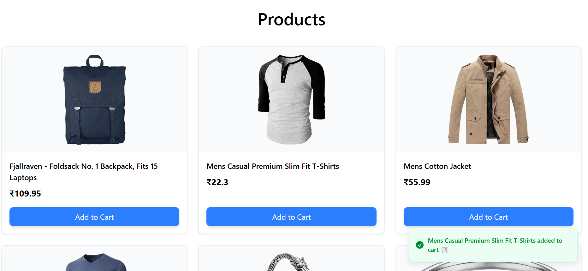
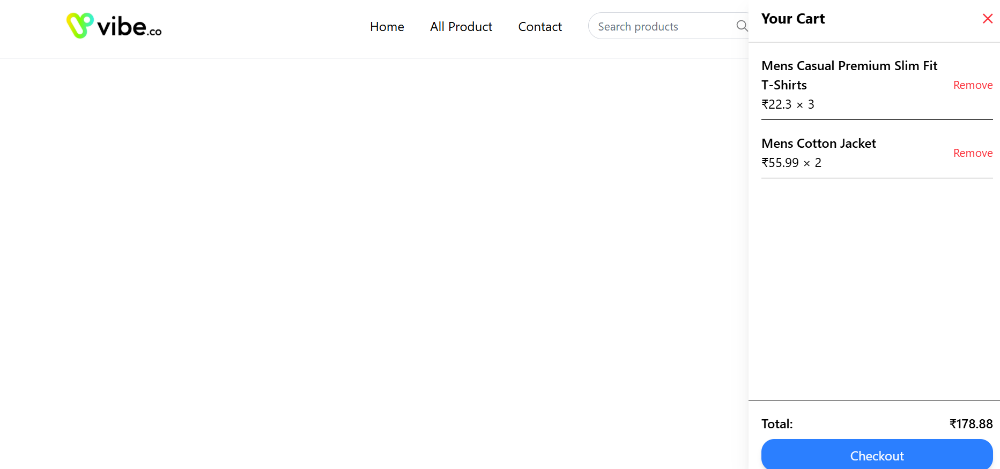
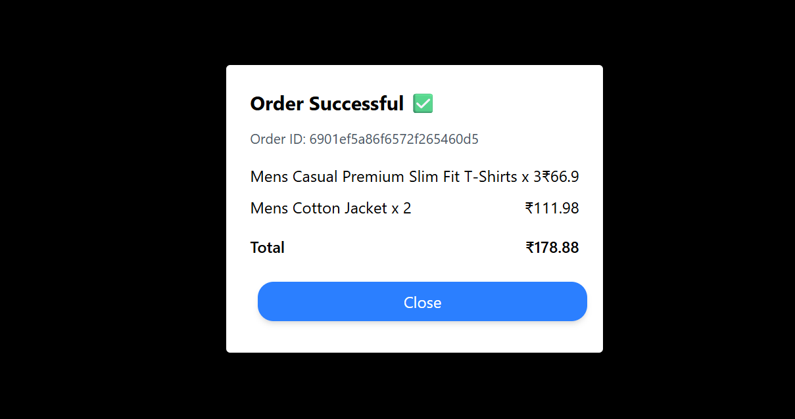

# FullStack Coding Assignment

This project is a full‑stack eCommerce style application built using **MERN stack** (MongoDB, Express, React, Node.js). It allows users to browse products, add them to cart, and manage cart items.

## 📌 Tech Stack

| Layer           | Technology                       |
| --------------- | -------------------------------- |
| Frontend        | React + TypeScript + TailwindCSS |
| Backend         | Node.js + Express                |
| Database        | MongoDB                          |
| Package Manager | pnpm                             |

## 🚀 Features

* Product listing
* Add to cart
* Remove from cart
* Cart total calculation
* Responsive UI drawer cart

## 📂 Project Structure

```
FullStack_Coding_Assignment/
├── Frontend/    → React TypeScript app
└── Backend/     → Express + MongoDB server
```

## 🛠️ Setup Instructions

### 1️⃣ Clone the repository

```bash
git clone https://github.com/ankit-1011/FullStack_Coding_Assignment.git
cd FullStack_Coding_Assignment
```

### 2️⃣ Backend Setup

```bash
cd Backend
pnpm install
pnpm run dev
```

The backend should now be running on: `http://localhost:5000`

### 3️⃣ Frontend Setup

```bash
cd ../Frontend/vite-project
pnpm install
pnpm run dev
```

Go to: `http://localhost:5173`

## 🖼️ Website Preview

Showcasing the core user journey of the shopping flow.

### 🏠 Landing Page

A clean and modern homepage introducing the store.


### 🛍️ Product Listing

Displays available products with price and CTA to add to cart.


### 🛒 Cart Drawer

Quick view of added products with running total.


### ✅ Checkout

Users can preview total price before finalizing purchase.


### 📦 Receipt Page (Order Summary)

Confirmation summary of purchase.


## ✅ API Endpoints

| Method | Endpoint      | Description              |
| ------ | ------------- | ------------------------ |
| GET    | /api/cart     | Fetch all cart items     |
| POST   | /api/cart     | Add product to cart      |
| DELETE | /api/cart/:id | Remove product from cart |

---

More documentation coming soon.
